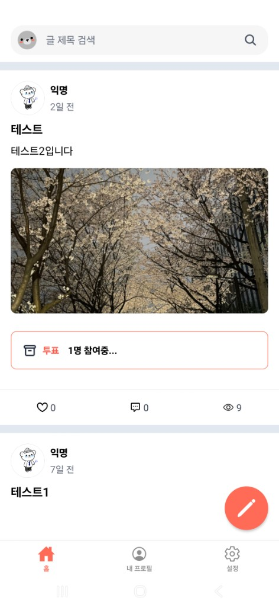
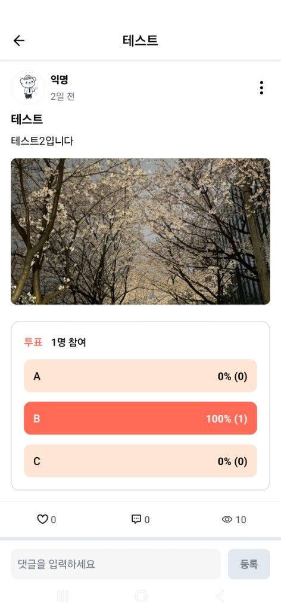
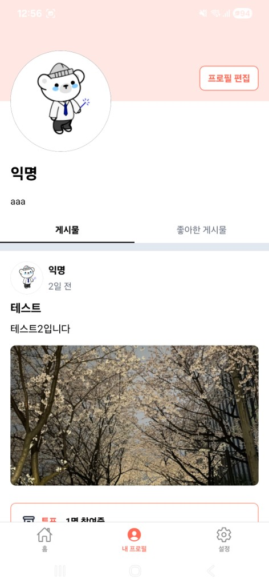
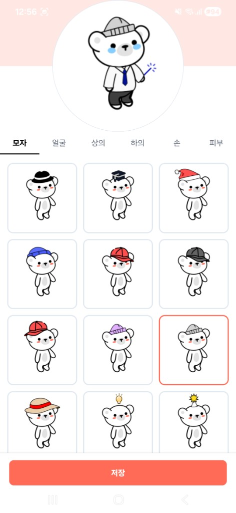

# Avatar Community

리액트 네이티브를 학습하기 위해 가볍게 만들어본 아바타 꾸미기와 커뮤니티 피드 기능을 결합한 모바일 소셜 앱입니다.<br />
커스텀 아바타를 만들고, 게시글·댓글·좋아요로 다른 사용자와 소통할 수 있습니다.

## 스크린샷

| 인증 진입 | 피드 (검색/목록) | 게시글 상세 (투표) | 내 프로필 | 아바타 편집 |
| :---: | :---: | :---: | :---: | :---: |
|  |  |  |  |  |

## 기술 스택

| 구분                | 기술                                                                                 |
| ------------------- | ------------------------------------------------------------------------------------ |
| **프레임워크**      | Expo SDK ~54, React Native 0.81                                                      |
| **언어**            | TypeScript (strict)                                                                  |
| **라우팅**          | Expo Router ~6 (파일 기반, `src/app/`)                                               |
| **서버 상태**       | TanStack React Query v5                                                              |
| **HTTP**            | Axios (인터셉터 기반 JWT 자동 주입 및 401 처리)                                      |
| **폼**              | React Hook Form                                                                      |
| **저장소**          | expo-secure-store (액세스 토큰)                                                      |
| **UI / 애니메이션** | react-native-reanimated, @gorhom/bottom-sheet, react-native-gesture-handler          |
| **미디어**          | expo-image, expo-image-picker, react-native-svg                                      |
| **기타 UI**         | react-native-toast-message, @expo/react-native-action-sheet, react-native-pager-view |

## 프로젝트 구조

```
src/
├── app/                          # Expo Router 페이지
│   ├── index.tsx                 # 진입점 (로그인 여부에 따라 리다이렉트)
│   ├── auth/                     # 인증 화면 (진입, 로그인, 회원가입)
│   └── (protected)/              # 인증 필요 화면 (AuthRoute 래핑)
│       ├── (tabs)/               # 탭 네비게이션
│       │   ├── home/             # 피드 (무한 스크롤, 검색)
│       │   ├── my/               # 내 프로필·게시글·좋아요
│       │   └── setting/          # 설정
│       ├── post/                 # 게시글 생성·수정
│       ├── detail/[id]/          # 게시글 상세·댓글·대댓글
│       └── profile/              # 프로필 조회·수정·아바타 편집
├── api/                          # API 함수
│   ├── config/
│   │   ├── axiosInstance.ts      # Axios 인스턴스 (인터셉터, JWT, 401 처리)
│   │   └── queryClient.ts        # React Query 클라이언트
│   ├── auth.ts                   # 회원가입, 로그인, 내 정보
│   ├── post.ts                   # 게시글 CRUD, 좋아요, 조회수, 이미지, 투표
│   ├── comment.ts                # 댓글 CRUD, 댓글 좋아요
│   ├── profile.ts                # 프로필 조회·수정
│   └── avatar.ts                 # 아바타 파츠 목록, 미리보기 합성
├── hooks/                        # React Query 훅
│   ├── queries/
│   │   ├── auth/                 # useAuth, useGetUserInfo
│   │   ├── post/                 # usePost, useComment, useViewCount
│   │   └── myPage/               # 무한 스크롤 게시글·좋아요, 아바타, 프로필
│   ├── avatar/                   # useAvatarController
│   ├── detail/                   # useDetailActions
│   └── reply/                    # useReplyController
├── components/                   # 공통 컴포넌트
│   ├── (공통 UI)                  # FeedItem, SearchBar, InputField, CommonButton 등
│   └── page/          # 페이지별 전용 컴포넌트
├── types/
│   └── index.ts                  # User, Profile, Post, Comment, Vote, AvatarItemState 등
├── constants/                    # 색상, React Query 키 팩토리
└── utils/                        # secureStore, ApiHeader, 이미지 헬퍼, debounce
```

